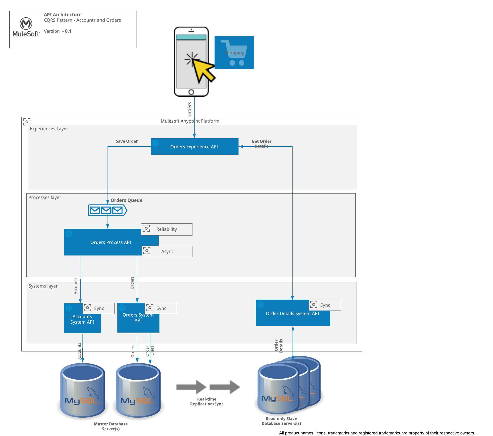
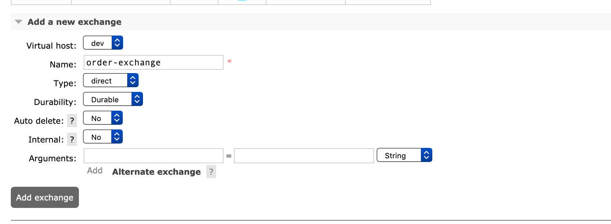
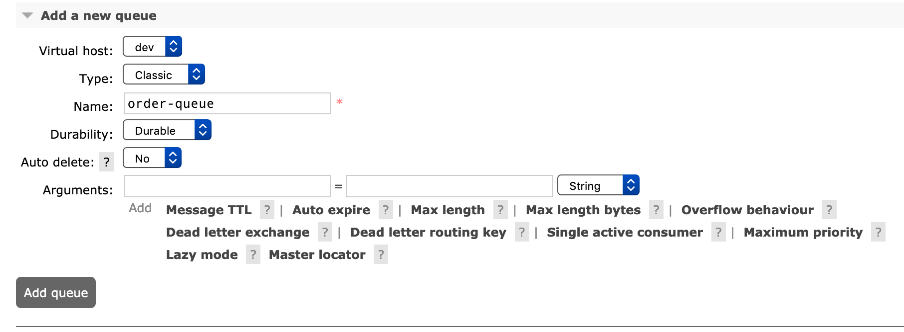
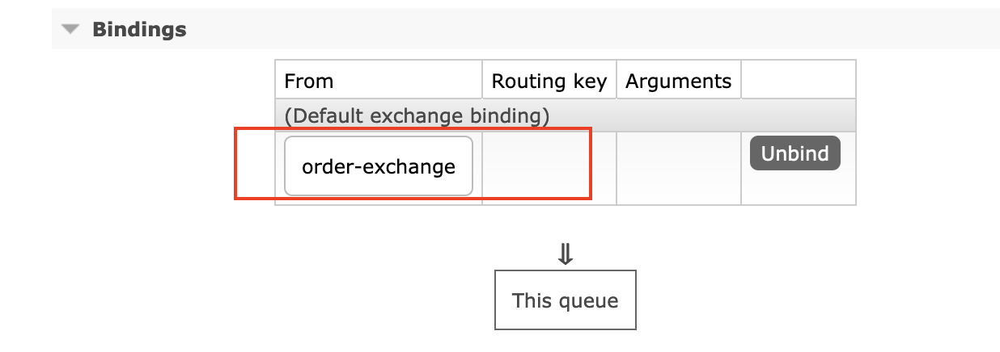

# CQRS Pattern

The Command and Query Responsibility Segregation (CQRS) pattern separates read and update operations for a data store. Implementing CQRS in your application can maximize its performance, scalability, and security.


### How?

* Commands should be task based, rather than data centric. ("Place Order").

* Commands may be placed on a queue for asynchronous processing, rather than being processed synchronously.

* Queries never modify the database. A query returns a DTO that does not encapsulate any domain knowledge.

* For greater isolation, the data-stores are physically separate the read data from the write data.

* The data-sync between write and read database is done using master-slave replication on mysql, however the same can be achieved using ETL tools or Mule Batch programs as well.

**A note of caution**:

* This pattern is not suitable if :-

  * The domain or the business rules are simple.

  * A simple CRUD-style operations are sufficient.

### Usecase

* An ecommerce site or Mobile App which allows to place order and query order details.

* The write model of the order not not just the order header and order lines but also customer related information to be created, and this is based on Task UI

* The read model of the order is based on complex queries.

* The number of reads are very high compared to writes.

* Eventual consistency of data is acceptable


* The following usecase is implemented using Mule as follows:-

  


##### Dependencies

To run this example, you will need :-
* Mule(On-premise)
* RabbitMQ
* MYSQL

### Setups


#### RabbitMQ
You can install it locally, using the following steps.

* For RabbitMQ installation instructions please follow the link below :-
```
https://www.rabbitmq.com/download.html
```

* After successful installation you should be able to run it Using
```
  export PATH=$PATH:/usr/local/opt/rabbitmq/sbin
  sudo rabbitmq-server
```
* To access Rabbit MQ use the following url :-
```
http://localhost:15672/
```

* Create Queues and Exchanges as per your configuration file.

* Create Order Exchange as direct  :-


* Create Order Queue as follows :-


* Bind exchange to queue and verify it as follows :-


#### MYSQL (Docker)

* Create Docker Network using the following Command
```
docker network create groupnet
```

* Pull mysql docker image
```
docker pull mysql
```

* Create master database server. We are using groupnet network group for our docker container.
```
docker run -p 3306:3306 -p 33060:33060 --name mysql-server-master --net=groupnet  --hostname=mysql-server-master -v $PWD/mysql-server-master-share:/var/lib/mysql -e MYSQL_ROOT_PASSWORD=Password -d mysql --bind-address=172.18.0.2 --server-id=1
```

* Creating Slave Database server and setting up replication is optional as you can point cqrs-order-details-sys-api to point to Master to test our example.

* But If you really want to do it in a proper way continue as outlined in
  * **MSQL-Replication.md**


* Run the table creation scripts under docs/scripts folder to create the underlying tables (customer, order_header, order_lines). You can use SQLWorkbench tool to connect to MYSQL database and execute the script.

### Contribution

PK Reddy

### References

https://docs.microsoft.com/en-us/azure/architecture/patterns/cqrs

https://martinfowler.com/bliki/CQRS.html


### Todos

None

### License

UNLICENSED
